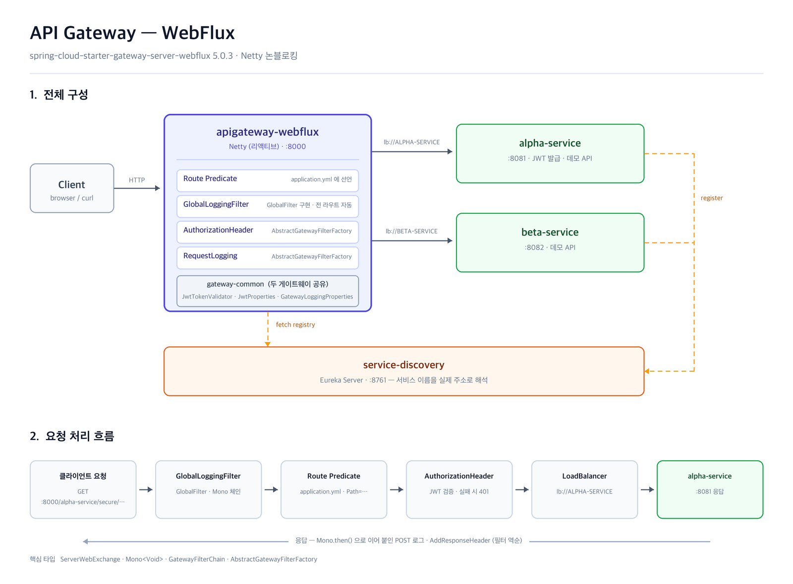
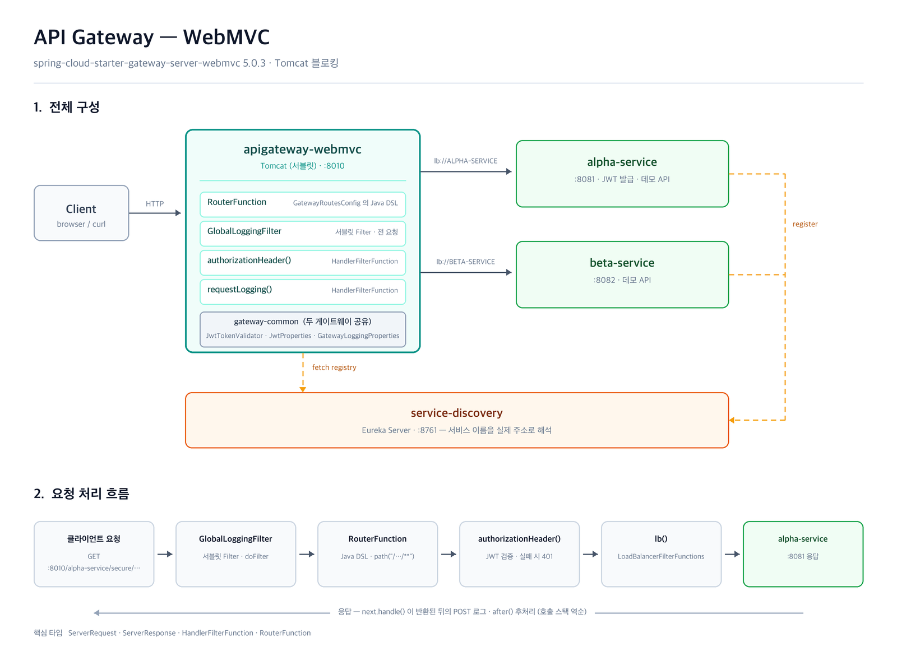

# API Gateway Service

마이크로서비스 앞단에서 **모든 외부 요청의 단일 진입점** 역할을 하는 API 게이트웨이.
클라이언트는 뒤에 서비스가 몇 개 있든, 각각 어느 주소에 떠 있든 알 필요 없이 게이트웨이 한 곳만 호출한다.

같은 요구사항을 **WebFlux**와 **WebMVC** 두 스택으로 각각 구현해 나란히 비교한다.

## 모듈

```
├── service-discovery/       :8761   Eureka Server
├── gateway-common/                  두 게이트웨이가 공유하는 라이브러리
├── apigateway-webflux/      :8000   Netty · 논블로킹
├── apigateway-webmvc/       :8010   Tomcat · 블로킹
├── alpha-service/           :8081   라우팅 대상 (JWT 발급 포함)
└── beta-service/            :8082   라우팅 대상
```

Spring Boot 4.1.1 / Spring Cloud 2025.1.3 / Java 17.

두 게이트웨이는 **동시에 띄울 수 있다.** 같은 요청을 8000과 8010에 각각 보내 응답과 로그를 비교하면 된다.

---

## 게이트웨이가 하는 일

| 역할 | 설명 |
|---|---|
| **단일 진입점** | 클라이언트는 게이트웨이 포트 하나만 안다. 서비스가 늘어나도 호출 주소는 그대로다. |
| **라우팅** | 요청 경로(`Path`)를 보고 어느 서비스로 보낼지 판별한다. |
| **서비스 디스커버리 연동** | 대상을 IP·포트가 아닌 `lb://ALPHA-SERVICE` 라는 **이름**으로 지정한다. 실제 주소는 Eureka가 알려준다. |
| **로드밸런싱** | 같은 이름으로 여러 인스턴스가 떠 있으면 자동으로 분산한다. |
| **횡단 관심사 처리** | 인증·로깅·헤더 조작을 게이트웨이가 대신 처리한다. 각 서비스는 자기 도메인 로직에만 집중한다. |

마지막 항목이 게이트웨이를 두는 실질적인 이유다. JWT 검증을 서비스마다 구현하면 서비스가 10개일 때 10벌이 되지만,
게이트웨이에 두면 한 곳에서 끝난다.

## 라우팅 규칙 (두 스택 공통)

| 요청 경로 | 대상 | 처리 |
|---|---|---|
| `/alpha-service/secure/**` | `lb://ALPHA-SERVICE` | Cookie 헤더 제거 → **JWT 검증** |
| `/alpha-service/**` | `lb://ALPHA-SERVICE` | 요청/응답 헤더 추가 → 라우트 로깅 |
| `/beta-service/**` | `lb://BETA-SERVICE` | 요청/응답 헤더 추가 → 라우트 로깅 |

라우트는 **위에서부터 순서대로** 검사한다. `/alpha-service/secure/**` 가 `/alpha-service/**` 보다 위에 있어야
보안 경로가 인증 없이 통과하지 않는다.

---

# WebFlux 게이트웨이 — `apigateway-webflux` :8000



```groovy
implementation 'org.springframework.cloud:spring-cloud-starter-gateway-server-webflux'
```

Netty 위에서 논블로킹으로 동작한다. 요청 처리 전체가 `Mono` 체인으로 이어지며, 스레드가 I/O를 기다리며 점유되지 않는다.
Spring Cloud Gateway의 원조 구현이고 기능 성숙도가 가장 높다. **특별한 이유가 없으면 이쪽이 기본 선택이다.**

### 라우트 정의 — `application.yml`

```yaml
spring:
  cloud:
    gateway:
      server:
        webflux:              # ← 접두사에 주의. 틀리면 에러 없이 라우트가 0개로 뜬다
          routes:
            - id: alpha-service-secure
              uri: lb://ALPHA-SERVICE
              predicates:
                - Path=/alpha-service/secure/**
              filters:
                - RemoveRequestHeader=Cookie
                - AuthorizationHeader
```

### 필터

| 클래스 | 방식 | 적용 범위 |
|---|---|---|
| `GlobalLoggingFilter` | `GlobalFilter` 인터페이스 구현 | 빈으로 등록만 하면 **전 라우트 자동 적용**. yml 설정 불필요 |
| `AuthorizationHeaderGatewayFilterFactory` | `AbstractGatewayFilterFactory` | yml에서 `AuthorizationHeader` 로 참조 |
| `RequestLoggingGatewayFilterFactory` | `AbstractGatewayFilterFactory` | yml에서 `RequestLogging` 으로 참조 |

클래스명이 `...GatewayFilterFactory` 로 끝나면 프레임워크가 접미사를 떼고 이름을 인식한다.
`shortcutFieldOrder()` 를 정의하면 `- RequestLogging=Alpha route` 같은 축약 표기도 쓸 수 있다.

```java
@Override
public GatewayFilter apply(Config config) {
    return (exchange, chain) -> chain.filter(exchange)
            .then(Mono.fromRunnable(() -> log.info("POST: {}", ...)));
}
```

**핵심 타입** — `ServerWebExchange`, `Mono<Void>`, `GatewayFilterChain`

---

# WebMVC 게이트웨이 — `apigateway-webmvc` :8010



```groovy
implementation 'org.springframework.cloud:spring-cloud-starter-gateway-server-webmvc'
```

서블릿(Tomcat) 위에서 블로킹으로 동작한다. 요청 하나가 스레드 하나를 점유한 채 응답까지 기다린다.
스택트레이스가 그대로 읽히고 디버거가 정상 동작하며, 필터에서 블로킹 라이브러리(JDBC 조회, 블로킹 인증 SDK 등)를
그냥 호출해도 된다. Java 21+ 가상 스레드를 쓰면 확장성 손해도 상당 부분 회복된다.

### 라우트 정의 — Java DSL (`GatewayRoutesConfig`)

```java
@Bean
public RouterFunction<ServerResponse> alphaServiceSecureRoute(JwtTokenValidator validator) {
    return route("alpha-service-secure")
            .route(path("/alpha-service/secure/**"), http())
            .before(removeRequestHeader("Cookie"))
            .filter(authorizationHeader(validator))
            .filter(lb("ALPHA-SERVICE"))
            .build();
}
```

`spring.cloud.gateway.server.webmvc.routes` 로 yml에 쓸 수도 있다. 다만 **커스텀 필터를 yml에서 이름으로 참조하려면
`FilterSupplier` 빈을 따로 등록**해야 하고, 그 필터는 정적 메서드여야 해서 의존성을 `MvcUtils.getApplicationContext()`
로 꺼내 써야 한다. DSL을 쓰면 필터를 그냥 빈으로 주입받을 수 있어 여기서는 DSL을 택했다.

`RouterFunction` 은 빈 등록 순서대로 평가되므로 더 구체적인 경로를 먼저 선언한다.

### 필터

| 클래스 | 방식 | 적용 범위 |
|---|---|---|
| `GlobalLoggingFilter` | `OncePerRequestFilter` (서블릿 필터) | **모든 요청.** actuator 등 게이트웨이 라우트가 아닌 것도 포함 |
| `AuthorizationHeaderFilters.authorizationHeader()` | `HandlerFilterFunction` | DSL에서 `.filter(...)` 로 부착 |
| `RequestLoggingFilters.requestLogging()` | `HandlerFilterFunction` | DSL에서 `.filter(...)` 로 부착 |

Gateway MVC에는 `GlobalFilter` 확장점도 `default-filters` 설정도 **없다.** 서블릿 스택이므로 표준 서블릿 필터가
그 자리를 대신한다. 적용 범위가 라우트 단위가 아니라 전 요청이라는 차이가 있다.

```java
public static HandlerFilterFunction<ServerResponse, ServerResponse> requestLogging(String baseMessage) {
    return (request, next) -> {
        log.info("PRE: {} {}", request.method(), request.path());
        ServerResponse response = next.handle(request);   // 블로킹
        log.info("POST: {}", response.statusCode());
        return response;
    };
}
```

**핵심 타입** — `ServerRequest`, `ServerResponse`, `HandlerFilterFunction`, `RouterFunction`

---

## 두 스택 비교

| | WebFlux `:8000` | WebMVC `:8010` |
|---|---|---|
| 스타터 | `...-gateway-server-webflux` | `...-gateway-server-webmvc` |
| 런타임 | Netty, 논블로킹 | Tomcat, 블로킹 |
| 설정 접두사 | `spring.cloud.gateway.server.**webflux**.*` | `spring.cloud.gateway.server.**webmvc**.*` |
| 패키지 | `o.s.c.gateway.*` | `o.s.c.gateway.**server.mvc**.*` |
| 라우트 정의 | application.yml | Java DSL (yml도 가능) |
| 전역 필터 | `GlobalFilter` 구현 | 서블릿 `Filter` |
| 라우트 필터 | `AbstractGatewayFilterFactory` | `HandlerFilterFunction` |
| 커스텀 필터를 yml에서 참조 | 빈 등록만 하면 됨 | `FilterSupplier` 빈 추가 등록 필요 |

**둘을 한 애플리케이션에 같이 넣을 수는 없다.** 하나는 리액티브, 하나는 서블릿 웹 애플리케이션으로 뜨기 때문에
클래스패스에 함께 두면 충돌한다. 그래서 모듈을 나눴다.

### 스택을 바꿔도 안 바뀌는 것 — `gateway-common`

| 클래스 | 역할 |
|---|---|
| `JwtTokenValidator` | 토큰 서명·subject 검증. 웹 타입을 전혀 쓰지 않는다 |
| `JwtProperties` | `jwt.secret` 바인딩 + 검증 |
| `GatewayLoggingProperties` | 전역 로깅 필터 설정 |

JWT 검증을 필터에서 분리해둔 덕분에, 웹 스택을 통째로 갈아엎어도 이 코드와 테스트 5개는 그대로 재사용된다.
스택 차이가 **필터 3개와 라우트 정의에만** 갇히는 구조다.

---

## 실행

`service-discovery` 를 먼저 띄운다. 나머지는 순서 무관.

```bash
./gradlew :service-discovery:bootRun
./gradlew :alpha-service:bootRun
./gradlew :beta-service:bootRun
./gradlew :apigateway-webflux:bootRun
./gradlew :apigateway-webmvc:bootRun
```

게이트웨이가 Eureka 레지스트리를 받아오기까지 최대 30초가 걸린다.
그 전까지 나오는 `No servers available for service: ALPHA-SERVICE` 경고는 정상이다.

Eureka 대시보드: http://localhost:8761

## 호출

같은 요청을 두 포트에 보내 비교한다.

```bash
curl http://localhost:8000/alpha-service/welcome    # WebFlux
curl http://localhost:8010/alpha-service/welcome    # WebMVC

curl http://localhost:8000/alpha-service/check      # 처리한 인스턴스의 실제 포트가 찍힌다
curl http://localhost:8010/beta-service/welcome
```

인증이 걸린 경로:

```bash
# 토큰 없이 호출하면 401
curl -i http://localhost:8000/alpha-service/secure/hello

# 토큰 발급 후 재호출
TOKEN=$(curl -s -X POST http://localhost:8000/alpha-service/token \
  | python3 -c 'import sys,json;print(json.load(sys.stdin)["accessToken"])')

curl -H "Authorization: Bearer $TOKEN" http://localhost:8000/alpha-service/secure/hello
curl -H "Authorization: Bearer $TOKEN" http://localhost:8010/alpha-service/secure/hello
```

> 토큰 발급은 원래 인증 전용 서비스의 책임이다. 여기서는 게이트웨이 필터를 확인하기 위해 `alpha-service` 에 최소 구현으로 두었다.

## 로드밸런싱 확인

`beta-service/src/main/resources/application.yml` 의 `port` 를 `0` 으로 바꾸고 여러 인스턴스를 띄운 뒤
`/beta-service/check` 를 반복 호출하면, 게이트웨이 설정은 그대로인 채로 응답 포트가 번갈아 바뀐다.

## 게이트웨이는 강제되지 않는다

`alpha-service` 와 `beta-service` 는 `8081`, `8082` 로 **직접 호출해도 응답한다.**
게이트웨이는 리버스 프록시일 뿐 트래픽을 가로채지 않는다.

로컬에서는 장애 지점을 가리는 데 오히려 편하다 — 8000이 실패할 때 8081을 직접 때려 보면
서비스가 죽은 것인지 라우팅이 틀린 것인지 바로 알 수 있다.
운영 환경이라면 게이트웨이만 외부에 노출하고 나머지는 내부망에 두거나, 서비스를 루프백에만 바인딩한다.

```yaml
server:
  address: 127.0.0.1
```

## 설정

| 키 | 위치 | 비고 |
|---|---|---|
| `jwt.secret` | 두 게이트웨이, `alpha-service` | 값이 **모두 같아야** 한다. HS256은 256bit 이상을 요구하므로 32자 이상. 짧으면 기동 시점에 실패한다. |
| `jwt.expiration` | `alpha-service` | 토큰 유효 기간. `24h`, `30m` 형식 |
| `gateway.logging.*` | 두 게이트웨이 | 전역 로깅 필터의 문구와 on/off. 생략하면 기본값 |

Config Server 를 붙이려면 `spring.config.import: optional:configserver:http://127.0.0.1:8888/` 를 쓴다.